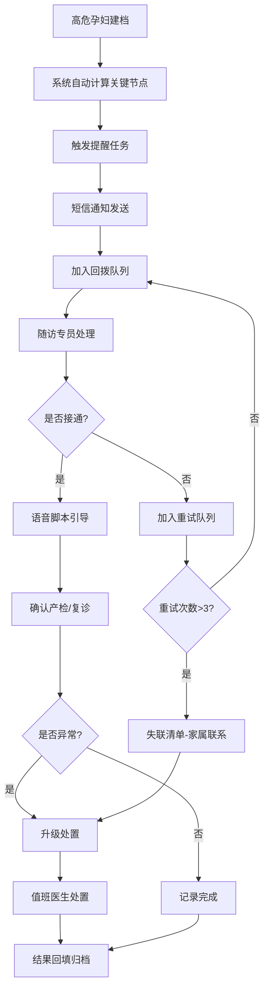

## 1. 产品概述

产科高危孕妇自动化回访服务系统，面向随访中心和产科值班人员，将高危孕妇的关键节点提醒、异常催办和失联补联标准化、自动化。解决人工盯不住、电话打不全、异常响应慢的核心问题，提升孕产妇安全管理水平。

## 2. 核心功能

### 2.1 用户角色

| 角色 | 登录方式 | 核心权限 |
|------|----------|----------|
| 随访专员 | 工号登录 | 查看提醒队列、执行回访、记录结果、补全信息 |
| 产科值班医生 | 工号登录 | 处理升级病例、查看异常指标、下达处置指令 |
| 系统管理员 | 账号登录 | 配置提醒规则、管理用户权限、查看统计报表 |

### 2.2 功能模块

1. **提醒配置模块**：产检提醒、异常触发规则、时间节点配置
2. **触发队列模块**：待办队列、优先级排序、自动分配、超时预警
3. **人工处理模块**：人工回拨队列、语音脚本提示、家属共同接听
4. **回访记录模块**：通话记录、处置结果回填、记录补全、漏访清单
5. **升级处置模块**：紧急情况上报码、夜间值守升级、逐级上报机制
6. **日终汇总模块**：当日统计、漏访清单、异常汇总、次日计划

### 2.3 页面详情

| 页面名称 | 模块名称 | 功能描述 |
|---------|---------|----------|
| 首页工作台 | 数据概览 | 今日待办、异常预警、关键指标卡、快捷入口 |
| 提醒配置页 | 提醒配置 | 产检提醒规则、异常指标阈值、时间节点设置、消息模板管理 |
| 任务队列页 | 触发队列 | 待回访列表、优先级筛选、自动分配、批量操作 |
| 回访处理页 | 人工处理 | 患者详情、语音脚本、通话记录、快捷操作按钮 |
| 回访记录页 | 回访记录 | 历史记录查询、处置结果回填、记录补全、漏访清单 |
| 升级处置页 | 升级处置 | 紧急上报、夜间值守、逐级上报、处置跟踪 |
| 日终汇总页 | 日终汇总 | 当日统计、完成率分析、异常汇总、次日工作计划 |

## 3. 核心流程

### 3.1 产检提醒流程
系统根据孕周自动计算产检日期，提前N天触发提醒任务 → 推送短信通知 → 加入人工回拨队列 → 随访专员拨打电话确认 → 记录回访结果 → 异常情况升级

### 3.2 异常指标处置流程
检验/检查结果返回 → 系统自动比对阈值 → 触发异常预警 → 推送紧急通知 → 值班医生评估 → 下达处置指令 → 随访执行 → 结果回填

### 3.3 失联补联流程
首次呼叫未接通 → 间隔重试（最多3次）→ 加入失联清单 → 家属联系通道 → 升级处置 → 记录补全

## 4. 用户界面设计

### 4.1 设计风格
- **主色调**：医疗蓝（#1E88E5）作为主色，传达专业、可信、安全的医疗氛围
- **辅助色**：预警红（#E53935）用于紧急异常、提醒橙（#FB8C00）用于待办提醒、成功绿（#43A047）用于已完成
- **中性色**：深灰（#37474F）正文、中灰（#78909C）辅助文字、浅灰（#ECEFF1）分割线/背景
- **按钮风格**：圆角8px，主按钮实色填充，次按钮描边样式，悬停有微动效
- **字体**：标题使用思源黑体 Bold，正文使用思源黑体 Regular，数字使用等宽字体
- **布局风格**：左侧导航栏 + 顶部状态栏 + 主内容区的经典后台布局，卡片式内容容器
- **图标风格**：线性图标，2px描边，圆角端点，与整体医疗专业风格统一

### 4.2 页面设计概览

| 页面名称 | 模块名称 | UI元素 |
|---------|---------|--------|
| 首页工作台 | 数据概览 | 顶部数据指标卡（今日待办、异常数、完成率、在院高危）、待办队列快速入口、异常预警列表、快捷操作区 |
| 提醒配置页 | 提醒配置 | 左侧规则分类导航、右侧规则列表卡片、规则编辑抽屉、开关控件、时间选择器 |
| 任务队列页 | 触发队列 | 顶部筛选栏（优先级/类型/状态）、列表视图（患者信息、任务类型、剩余时间、操作按钮）、批量处理工具栏 |
| 回访处理页 | 人工处理 | 左侧患者信息卡、中间语音脚本区、右侧通话记录/操作区、底部快捷操作按钮组 |
| 回访记录页 | 回访记录 | 搜索筛选栏、记录列表、详情抽屉、回填表单、漏访标记 |
| 升级处置页 | 升级处置 | 紧急上报卡、逐级上报流程线、处置记录时间轴、值班医生信息 |
| 日终汇总页 | 日终汇总 | 统计图表（柱状图/饼图）、完成率仪表盘、异常分类统计、漏访清单、次日计划 |

### 4.3 响应式
- 以桌面端为主要设计目标（1280px及以上）
- 平板端自适应，导航栏可折叠
- 关键操作按钮支持触屏操作，最小点击区域44x44px

### 4.4 动效与交互
- 页面切换使用淡入过渡（200ms ease）
- 数据卡片加载有骨架屏动效
- 异常预警条目有呼吸灯动效提示
- 按钮悬停有微缩放和阴影变化
- 任务状态变更有平滑过渡动画
