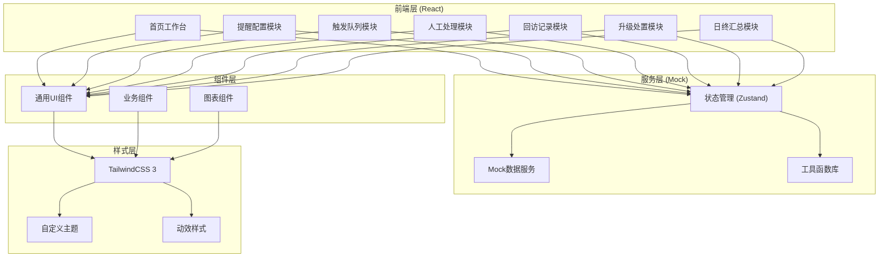
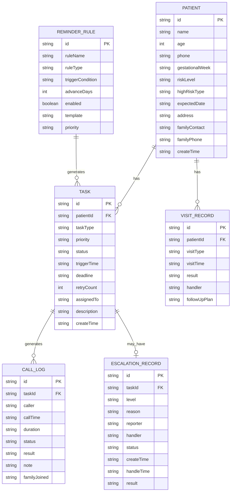

## 1. 架构设计



## 2. 技术描述

- **前端框架**：React@18 + TypeScript
- **构建工具**：Vite@5
- **状态管理**：Zustand@4（轻量级状态管理，适合中型应用）
- **UI样式**：TailwindCSS@3 + PostCSS
- **路由**：React Router DOM@6
- **图标库**：Lucide React（轻量级线性图标，符合医疗系统风格）
- **图表库**：Recharts（React图表库，支持柱状图、饼图、折线图）
- **日期处理**：date-fns（轻量级日期工具库）
- **后端**：无真实后端，使用Mock数据模拟

## 3. 路由定义

| 路由 | 页面名称 | 模块归属 |
|------|----------|----------|
| /dashboard | 首页工作台 | 数据概览 |
| /reminder-config | 提醒配置页 | 提醒配置模块 |
| /task-queue | 任务队列页 | 触发队列模块 |
| /callback | 回访处理页 | 人工处理模块 |
| /records | 回访记录页 | 回访记录模块 |
| /escalation | 升级处置页 | 升级处置模块 |
| /daily-summary | 日终汇总页 | 日终汇总模块 |

## 4. 数据模型

### 4.1 数据模型定义



### 4.2 数据字典

#### 患者风险等级 (riskLevel)
| 值 | 说明 | 颜色 |
|----|------|------|
| high | 高危 | 红色 #E53935 |
| medium | 中危 | 橙色 #FB8C00 |
| low | 低危 | 绿色 #43A047 |

#### 任务类型 (taskType)
| 值 | 说明 |
|----|------|
| prenatal_check | 产检提醒 |
| abnormal_index | 异常指标 |
| follow_up | 随访回访 |
| revisit_miss | 复诊未到 |
| lost_contact | 失联补联 |
| emergency | 紧急上报 |

#### 任务状态 (status)
| 值 | 说明 |
|----|------|
| pending | 待处理 |
| processing | 处理中 |
| completed | 已完成 |
| escalated | 已升级 |
| failed | 失败/未接通 |

#### 优先级 (priority)
| 值 | 说明 |
|----|------|
| urgent | 紧急（立即处理） |
| high | 高（2小时内） |
| medium | 中（当日处理） |
| low | 低（三日内） |

#### 升级级别 (level)
| 值 | 说明 |
|----|------|
| level1 | 一级（值班医生） |
| level2 | 二级（科室主任） |
| level3 | 三级（医务科） |

## 5. 目录结构

```
src/
├── assets/              # 静态资源
│   ├── images/
│   └── icons/
├── components/          # 通用组件
│   ├── ui/             # 基础UI组件
│   │   ├── Button.tsx
│   │   ├── Card.tsx
│   │   ├── Tag.tsx
│   │   ├── Modal.tsx
│   │   ├── Drawer.tsx
│   │   ├── Table.tsx
│   │   ├── Switch.tsx
│   │   └── Input.tsx
│   ├── layout/         # 布局组件
│   │   ├── Sidebar.tsx
│   │   ├── Header.tsx
│   │   └── Layout.tsx
│   └── business/       # 业务组件
│       ├── PatientCard.tsx
│       ├── TaskCard.tsx
│       ├── CallScript.tsx
│       ├── StatusBadge.tsx
│       └── Timeline.tsx
├── pages/              # 页面组件
│   ├── Dashboard.tsx
│   ├── ReminderConfig.tsx
│   ├── TaskQueue.tsx
│   ├── Callback.tsx
│   ├── Records.tsx
│   ├── Escalation.tsx
│   └── DailySummary.tsx
├── store/              # 状态管理
│   ├── usePatientStore.ts
│   ├── useTaskStore.ts
│   ├── useCallStore.ts
│   └── useConfigStore.ts
├── mock/               # Mock数据
│   ├── patients.ts
│   ├── tasks.ts
│   ├── callLogs.ts
│   ├── records.ts
│   └── config.ts
├── utils/              # 工具函数
│   ├── date.ts
│   ├── format.ts
│   └── validator.ts
├── types/              # TypeScript类型定义
│   ├── patient.ts
│   ├── task.ts
│   ├── call.ts
│   └── config.ts
├── styles/             # 全局样式
│   └── globals.css
├── App.tsx
├── main.tsx
└── vite-env.d.ts
```

## 6. 核心技术决策

### 6.1 状态管理选择
选择 Zustand 而非 Redux，原因：
- 医疗随访系统为中型应用，状态管理复杂度适中
- Zustand API 简洁，学习成本低，开发效率高
- 支持 Immer 风格的状态更新，代码更简洁
- 包体积小，性能优异

### 6.2 样式方案
选择 TailwindCSS 原子化CSS方案：
- 开发效率高，无需频繁切换CSS文件
- 统一的设计令牌（Design Token）确保视觉一致性
- 响应式设计支持良好
- 与医疗系统的专业简洁风格匹配

### 6.3 图表库选择
选择 Recharts：
- React 原生实现，组件化使用
- 支持柱状图、饼图、折线图等常用图表
- 可定制性强，支持自定义样式
- 文档完善，社区活跃

### 6.4 图标库选择
选择 Lucide React：
- 线性图标风格，符合医疗系统专业简洁的定位
- 图标丰富，覆盖常见业务场景
- 支持自定义大小、颜色、描边宽度
- 轻量级，按需引入
